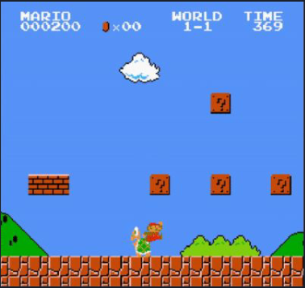
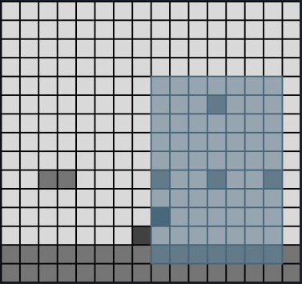
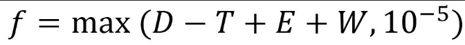
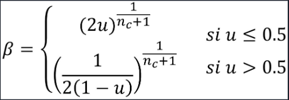
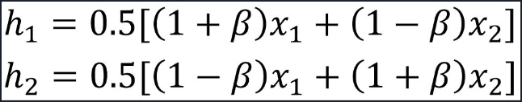
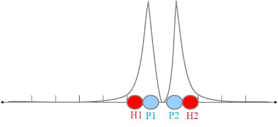
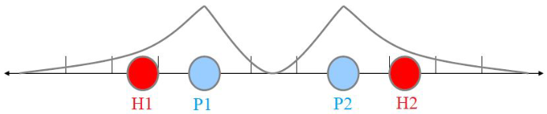
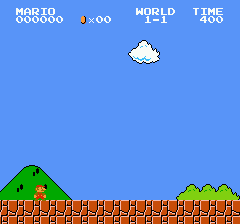
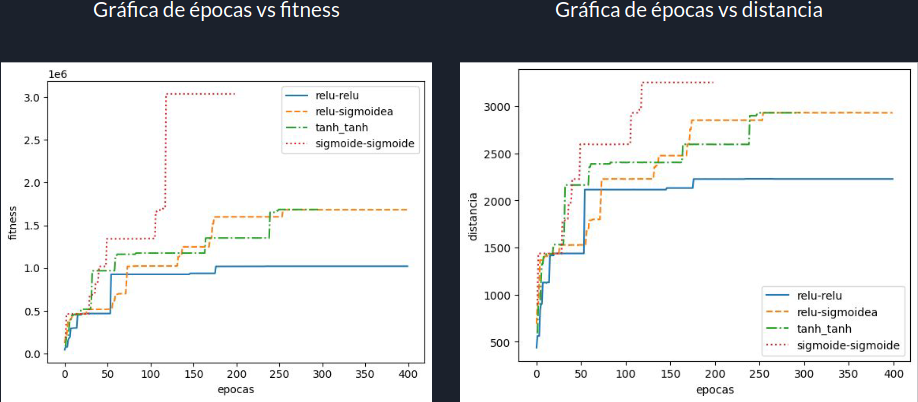
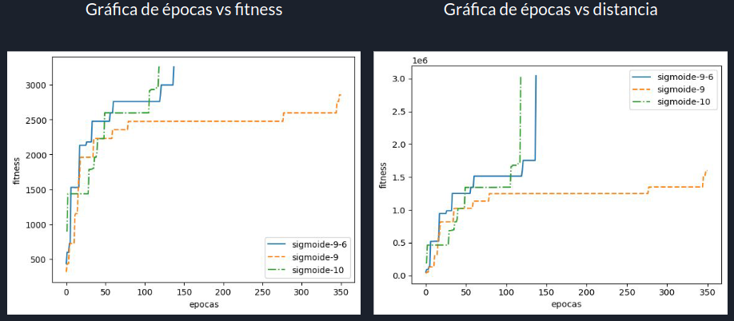

# Algoritmo neuroevolutivo para jugar Super Mario Bros de manera automática

## En que consiste

Uso de algoritmos geneticos para entrenar un perceptron multicapa, para que este sea capaz de pasar el primer nivel del clasico juego _"Super Mario Bros"_.

## Procesamiento de las entradas

Dentro de la carpeta _ROM_ tenemos una rom del juego objetivo. este es cargado con la libreria _gym-reto_ de python y junto a la implementacion hecha en este [repo](https://github.com/Chrispresso/SuperMarioBros-AI), procesamos los frames del juego para obtener una matriz de 15x16. En esta matriz obtenemos la informacion de donde se encunetra ubicado mario, los enemigos y demas informacion del terreno.

En la segunda imagen podemos apreciar una region sombreada de 10x7, que conforman parte de las 80 entradas al perceptron multicapa. Las 10 entradas restantes, podriamos pensarlo como 10 bits de los cuales el unico bit activo es el que corresponde a la posicion _y_ de mario en la matriz de 10x7. 

Estas entradas son calculadas por cada frame y alimentan un **MLP** que cuenta en su capa de salida con una estructura fija de 6 neuronas que representan cada uno de las teclas que son utilizadas en el juego (A, B, up, down, left, right).

## Algoritmo genetico

Contamos con una poblacion de jugadores (cada jugador es un MLP independiente), estos se operan generacionalmente desde el fenotipo (es decir, sin codificacion) manteniendo una arquitectura neuronal fija en cada una de las generaciones.

El metodo de seleccion utilizado es por competencias, donde se toma un grupo de individuos y vemos cual es el que tiene me mejor fitness. La funcion de fitnes esta dado por:

Donde:
- D = distancia máxima recorrida por el individuo
- T = tiempo de vida del individuo
- W = valor dependiente de la victoria del individuo
- E = función de arranque temprano, definido como _E=min(max(distancia - 50,0),1) * 2500_

Se utilizo una mutacion gaussiana 

> x_m = x_i + N(x̄, 𝜎)

donde:
- x_m = gen mutado
- x_i = gen elegido
- x̄ = media
- 𝜎 = desviación estándar

Como método de cruza utilizado tomamos la cruza binaria simulada (SBC o SBX) que simula el método de cruza binaria de un solo punto (single-point). Trabaja en base a números reales y una función de distribución de probabilidad n_c.

Se parte con la generación de un número u entre [0,1) y un valor 𝛽  de la siguiente forma:

Los hijos h1 y h2 se obtendrán de la siguiente forma a partir de los padres x1 y x2

Valores grandes de nc generará hijos cercanos a los padres

Valores chicos de nc generará hijos alejados de los padres

## Resultados

| Método de Activación | Máximo Fitness | Máxima Distancia | Nro épocas |
| - | - | - | - |
| ReLU-ReLU | 1.251596 | 2475 | 913 |
| ReLU-Sigmoidea | 1.733173 | 2980 | 492 |
| Tanh-Tanh | 1.685962 | 2930 | 249 |
| Sigmoidea-Sigmoidea | 3.037415 | 3252 | 118 |

|Sigmoidea-Sigmoidea | Máximo Fitness | Máxima Distancia | Nro épocas |
| -|-|-|-|
|Sigmoidea-9-6 | 3.044230 | 3254 | 137 |
|Sigmoidea-9 | 1.600269 | 2852 | 348 |
|Sigmoidea-10 | 3.037415 | 3252 | 118 |

> TP final, catedra de inteligencia computacional (FICH).
>
> Alumnos: Axel Rueda, Leandro Vargas y Gabriel Dorsch